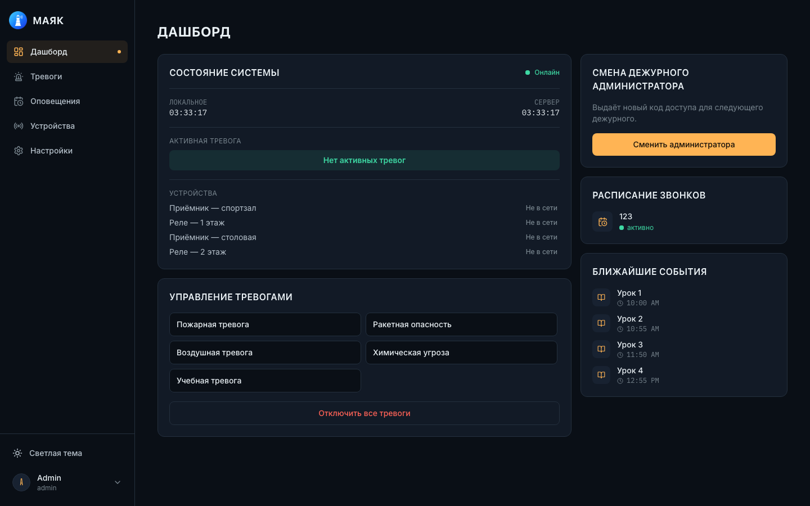
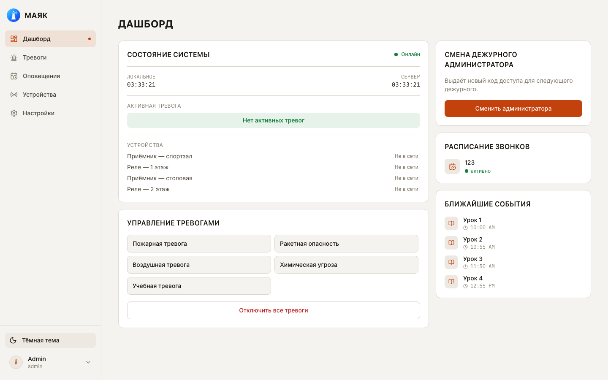
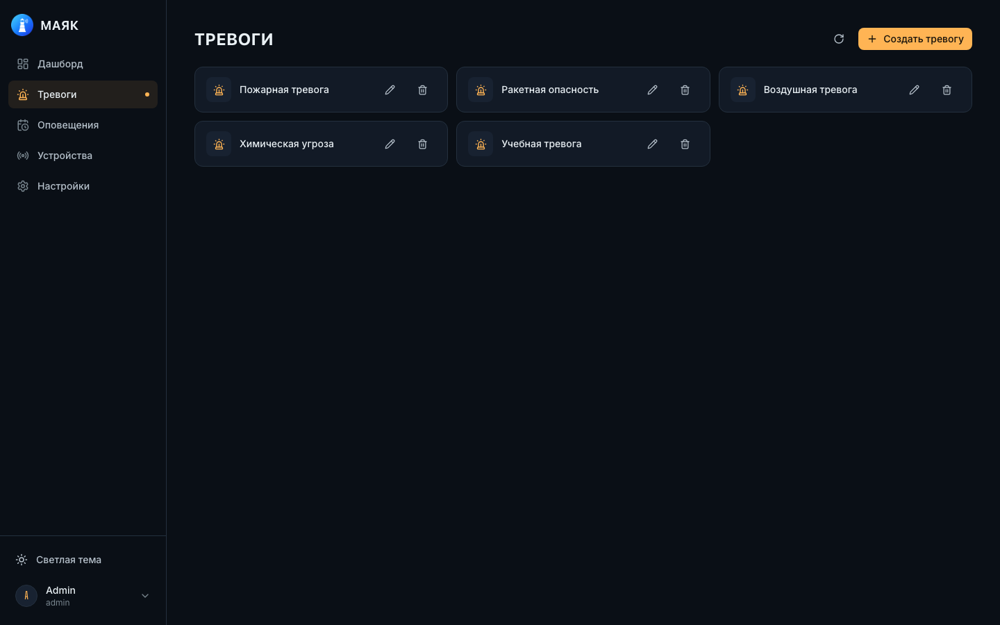
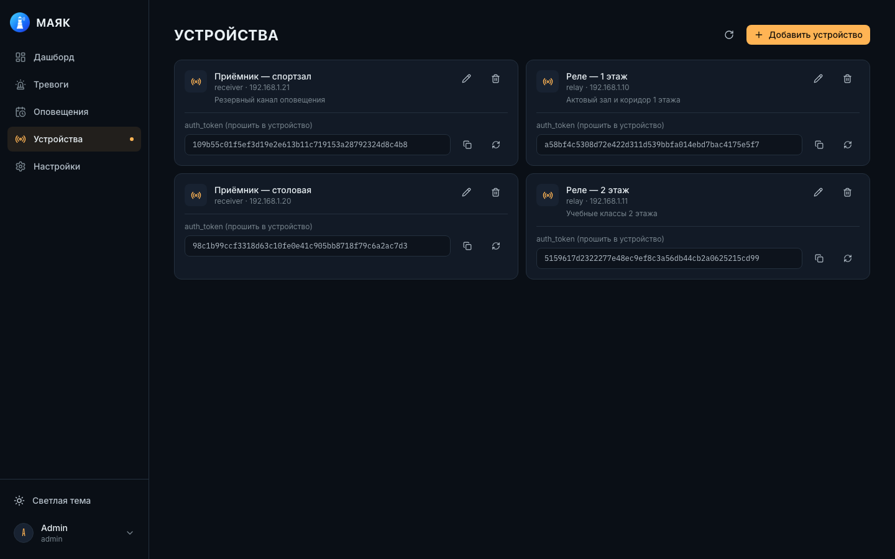
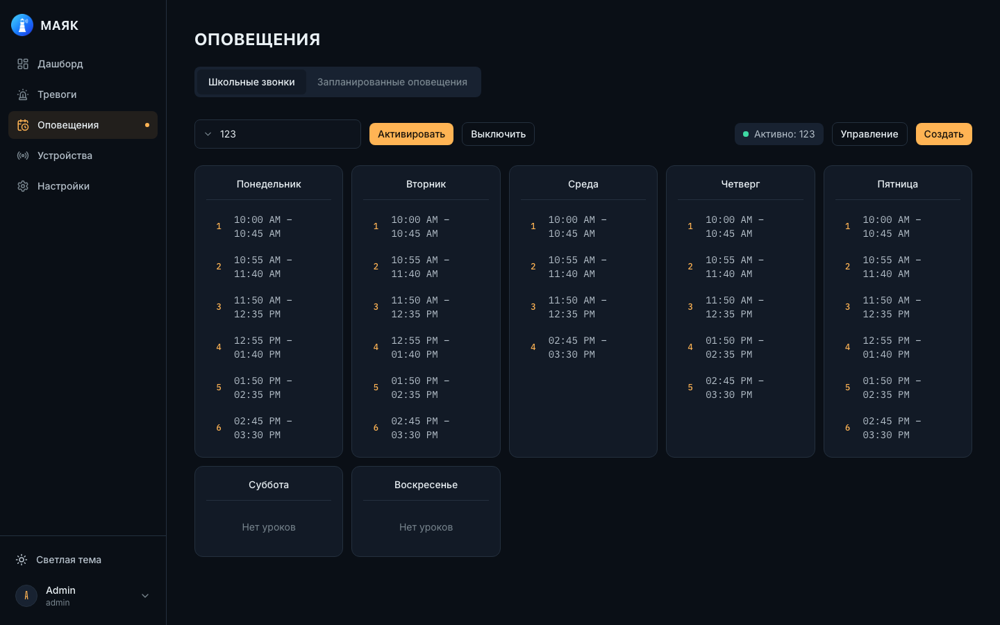

<div align="center">


# Маяк

**Система управления звуковыми оповещениями** — тревоги, школьные звонки и
запланированные уведомления с панели дежурного администратора.

[](LICENSE)
[](https://github.com/Denchikper/mayak/releases)


</div>

Маяк — панель дежурного администратора для управления системой звукового
оповещения: активация тревог (пожарная, воздушная, химическая и т. д.) на
реле и приёмниках, расписание школьных звонков по дням недели и
запланированные разовые/периодические оповещения. Бэкенд — Node.js/Express
с WebSocket для устройств, фронтенд — React + Vite, тема оформления
«ночное море + янтарный луч маяка» со светлой и тёмной темой.

## Скриншоты

<table>
  <tr>
    <td width="50%"></td>
    <td width="50%"></td>
  </tr>
  <tr>
    <td align="center"><sub>Дашборд — тёмная тема</sub></td>
    <td align="center"><sub>Дашборд — светлая тема</sub></td>
  </tr>
  <tr>
    <td></td>
    <td></td>
  </tr>
  <tr>
    <td align="center"><sub>Тревоги</sub></td>
    <td align="center"><sub>Устройства</sub></td>
  </tr>
  <tr>
    <td colspan="2"></td>
  </tr>
  <tr>
    <td colspan="2" align="center"><sub>Расписание звонков по дням недели</sub></td>
  </tr>
</table>

## Возможности

- **Тревоги.** Набор каналов оповещения (пожарная, ракетная, воздушная,
  химическая, учебная и произвольные) с активацией в один клик и
  подтверждением, деактивация всех разом.
- **Устройства.** Реле и приёмники по IP, `auth_token` для прошивки в
  железо, перевыпуск токена, статус «в сети / не в сети» в реальном времени.
- **Расписание школьных звонков.** Уроки по дням недели, несколько
  расписаний, переключение активного, редактор с добавлением/удалением
  уроков и автоматическим пересчётом порядка после удаления.
- **Запланированные оповещения.** Разовые и периодические (ежедневно,
  еженедельно, ежемесячно) срабатывания по каналу или тревоге.
- **Дашборд.** Состояние сервера и устройств, активная тревога, ближайшие
  события (оповещения + уроки активного расписания), быстрая смена
  дежурного администратора.
- **RBAC.** Роли и точечные права доступа к разделам и блокам интерфейса,
  журнал действий.
- **Устройства (ESP).** Прошивки для реле/приёмников на WT32-ETH01 —
  см. [devices/](devices) и [docs/DEVICES.md](docs/DEVICES.md).

## Технологии

| Слой | Стек |
|------|------|
| Backend | Node.js + Express, WebSocket, Sequelize (Postgres), JWT |
| Frontend | React 19 + Vite, Tailwind CSS 4, React Router |
| Шрифты | Big Shoulders Display + Inter + IBM Plex Mono (самохостинг, офлайн) |
| БД | PostgreSQL |
| Деплой | Docker Compose, готовые образы из GHCR, релиз по тегу |

## Структура

```bash
mayak/
├── server/                          # Backend (Node.js + Express + WS + Sequelize)
├── web/                             # Frontend (React + Vite + Tailwind)
├── devices/                         # Прошивки и схемы устройств (ESP)
├── docs/                            # Документация
├── docker-compose.yaml              # Локальная сборка из исходников
├── docker-compose.hostnet.yaml      # Сборка из исходников + host network
├── docker-compose.ghcr.yaml         # Готовые образы из GHCR
├── docker-compose.ghcr.hostnet.yaml # Готовые образы GHCR + host network
├── .env.example                     # Пример переменных окружения
└── README.md
```

## Установка

Быстрый локальный запуск:

```bash
cp .env.example .env
docker compose up --build
```

- Frontend: `http://localhost:3000`
- Backend API и WebSocket: `http://localhost:8080`
- Первый вход: **`admin` / `admin`** (создаётся сидом на пустой БД — смените пароль сразу после входа)

Деплой на прод (host network, готовые образы GHCR, релизы по тегу),
конфигурация `.env`/RBAC и подключение устройств — подробности в [docs/](docs/):

- [Конфигурация (.env, БД, RBAC)](docs/CONFIGURATION.md)
- [Деплой (docker compose, GHCR, релизы)](docs/DEPLOYMENT.md)
- [Устройства (auth_token, проверка по IP)](docs/DEVICES.md)

## Разработка

```bash
# backend
cd server && npm install && npm run dev

# frontend
cd web && npm install && npm run dev    # http://localhost:3000
```

Фронтенд без бэкенда открывается и рендерится (можно смотреть дизайн), но
запросы к `/api` не пройдут — нужен поднятый `server` (см. выше) и прокси
`/api` на его порт в `web/vite.config.js`, если запускаете `web` отдельно
от `docker compose`.

## Лицензия

[AFL-3.0](LICENSE) © Daniel Benovich

---

<div align="center"><sub>by <a href="https://github.com/Denchikper">Benovich</a></sub></div>
